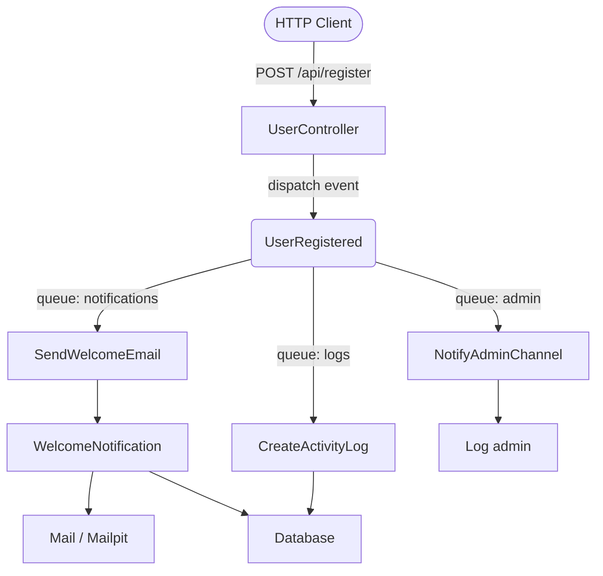
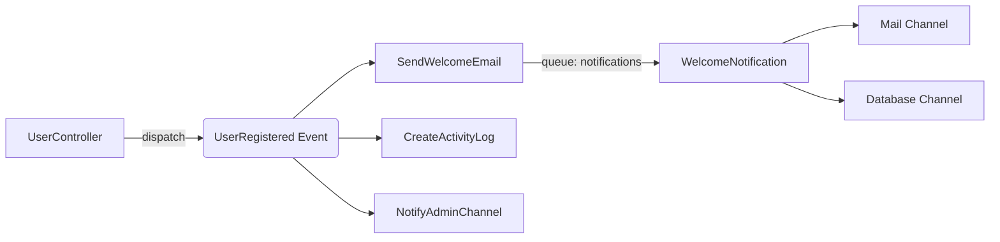

# Event-Driven Notifications

[](https://laravel.com)
[](https://php.net)
[](LICENSE)

Event-driven notification system built with Laravel 13. It demonstrates how to decouple side effects from the main flow using Laravel's event system: when a user registers, multiple listeners are triggered asynchronously (welcome email, activity log, and admin channel notification), each running on its own queue.

---

## Architecture: Event-Driven Architecture (EDA)

The applied architecture is **Event-Driven**. The controller does not call any email, log, or notification service directly. It simply dispatches an event and moves on. Each listener reacts independently on its own queue, allowing new behaviors to be added without touching existing code.



## Event Flow



---

## Installation

### Prerequisites

- [Docker](https://www.docker.com/) and Docker Compose
- [VSCode](https://code.visualstudio.com/) with the [Dev Containers](https://marketplace.visualstudio.com/items?itemName=ms-vscode-remote.remote-containers) extension (recommended)

### Steps

```bash
# 1. Clone the repository
git clone <repo-url>
cd event-driven-notifications

# 2. Build the containers
docker compose build

# 3. Start the services in the background
docker compose up -d
```

> If you use VSCode with Dev Containers, opening the project inside the container will automatically run `composer install`.

### Configure the environment

Copy the example file and update the variables:

```bash
cp .env.example .env
php artisan key:generate
```

#### Database (PostgreSQL)

```env
DB_CONNECTION=pgsql
DB_HOST=postgres
DB_PORT=5432
DB_DATABASE=event-driven-notifications
DB_USERNAME=event-driven-notifications_user
DB_PASSWORD=secret
```

#### Mail (Mailpit)

```env
MAIL_MAILER=smtp
MAIL_SCHEME=null
MAIL_HOST=mailpit
MAIL_PORT=1025
MAIL_USERNAME=null
MAIL_PASSWORD=null
MAIL_FROM_ADDRESS="hello@example.com"
MAIL_FROM_NAME="${APP_NAME}"
```

> Emails sent in development are captured by Mailpit. You can view them at [http://localhost:8025](http://localhost:8025).

### Run migrations

```bash
php artisan migrate
```

---

## Running workers

Each listener runs on its own queue. You must start a worker per queue for jobs to be processed:

```bash
# Email queue (SendWelcomeEmail)
php artisan queue:work --queue=notifications

# Activity log queue (CreateActivityLog)
php artisan queue:work --queue=logs

# Admin notification queue (NotifyAdminChannel)
php artisan queue:work --queue=admin
```

> If workers are not running, jobs will be queued in the `jobs` table but never executed.

---

## Running tests

Tests use an in-memory SQLite database and synchronous queues, so Docker is not required:

```bash
php artisan test
```

---

## Patterns and principles

### Design Pattern

#### Observer
Defines a one-to-many relationship between objects: when one object changes state, all its dependents are notified automatically without being tightly coupled to it.

| Where it applies | Description |
|---|---|
| `UserRegistered` + Listeners | `UserController` dispatches the event without knowing who is listening. `SendWelcomeEmail`, `CreateActivityLog`, and `NotifyAdminChannel` react independently. Adding a new side effect does not require touching the controller. |

### SOLID Principles

#### SRP — Single Responsibility
A class should have only one reason to change, meaning it should have only one responsibility.

| Where it applies | Description |
|---|---|
| Each Listener | `SendWelcomeEmail` only sends the email, `CreateActivityLog` only writes the log, `NotifyAdminChannel` only notifies the admin. None of them mix responsibilities. |

#### OCP — Open/Closed
Classes should be open for extension but closed for modification.

| Where it applies | Description |
|---|---|
| Event system | Adding a new behavior to the registration flow (e.g. sending an SMS) only requires creating a new Listener. `UserController` and existing listeners are not modified. |
